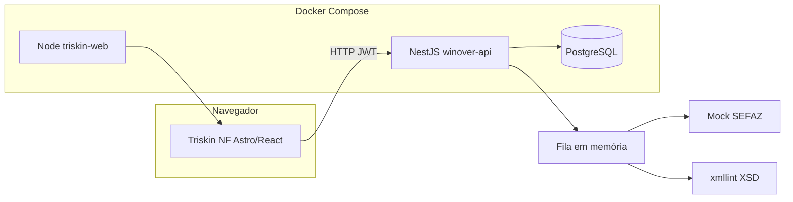

# Triskin NF — desafio técnico (monorepo)

Este repositório implementa um **cenário de emissão simulada de NF-e** para avaliação técnica: um **microserviço REST em NestJS** (PostgreSQL, JWT, fila assíncrona, validação de XML com **XSD** via `xmllint`, **mock da SEFAZ**) e um **frontend Astro + React** que consome a API (login, health check, estado com Zustand).

O foco do desafio é demonstrar **arquitetura limpa**, **persistência**, **segurança básica (JWT)**, **processamento assíncrono**, **contrato de API documentado (Swagger)** e **entrega reproduzível com Docker**.

---

## Objetivos do desafio

| Área | O que se espera demonstrar |
|------|----------------------------|
| **Domínio fiscal (simplificado)** | Ciclo de vida da nota: aceitação → processamento → autorização ou rejeição; XML apenas quando autorizada. |
| **Integração “ERP”** | Destinatário e produtos vêm de um **ERP fictício** em banco (seed); CNPJ, IE e UF devem bater com o cadastro. |
| **Assíncrono** | `POST /nfe` retorna rápido; autorização/rejeição ocorre em **worker de fila** em memória. |
| **Qualidade de dados** | Montagem de XML e validação contra **XSD** antes de simular envio à SEFAZ. |
| **API produto** | DTOs validados, erros HTTP consistentes, **Swagger** em `/docs`. |
| **Front** | App moderno (Astro 6, React 19) integrado à API via URL configurável (`PUBLIC_API_URL`). |
| **DevOps** | `docker compose` sobe Postgres + API + site (**Astro SSR** em Node); CI na raiz roda lint, testes e build só do **`winover-api`**. |

---

## Arquitetura (visão geral)



- O **browser** chama a API na URL pública (ex.: `http://localhost:3000`), não pelo hostname interno do Compose (`winover-api`).
- A **API** grava NF-e, enfileira emissão, gera/valida XML e persiste resultado (autorizada/rejeitada).

---

## Estrutura do repositório

| Pasta | Descrição |
|--------|------------|
| `winover-api/` | API REST: auth JWT, NF-e, ERP fictício (clientes/produtos), fila, Swagger `/docs` |
| `triskin-nf/` | Astro SSR + React 19 + Tailwind 4; login com **cookie HttpOnly** + **middleware** (JWT); Zustand só para UI |
| `docker-compose.yml` | Orquestra `postgres`, `winover-api`, `triskin-web` |
| `.env.example` | Modelo de variáveis para Compose e desenvolvimento |

---

## Fluxo da NF-e (regras de negócio)

1. **Autenticação**: obtenha um JWT com `POST /auth/register` ou `POST /auth/login`.
2. **Criação**: `POST /nfe` com destinatário e itens. A API valida destinatário (CNPJ, IE, UF) e cada item (produto existente no ERP, CFOP, CST, quantidades/valores).
3. **Resposta imediata**: `{ id, numero, status: "processamento" }`.
4. **Worker**: monta XML, valida XSD, chama **mock SEFAZ** (delay configurável; opção de forçar rejeição).
5. **Consulta**: `GET /nfe/:id` → `processamento` | `autorizada` | `rejeitada` (com protocolo/chave ou motivo de rejeição quando aplicável).
6. **XML**: `GET /nfe/:id/xml` somente se status for **autorizada** (retorno `application/xml`).

---

## API — rotas principais

| Método | Rota | Auth | Descrição |
|--------|------|------|-----------|
| `GET` | `/` | Não | Health: `{ status, service }` |
| `POST` | `/auth/register` | Não | Cadastro; retorna `access_token` |
| `POST` | `/auth/login` | Não | Login; retorna `access_token` |
| `GET` | `/auth/me` | JWT | Dados do usuário autenticado |
| `GET` | `/nfe` | JWT | Lista NF-e (resumo; `?limit=` até 200) |
| `GET` | `/nfe/stats` | JWT | Totais, contagem por status e série **por dia civil** (últimos 30 dias no fuso configurável; padrão **`America/Sao_Paulo`**, env `STATS_TIMEZONE` na API) |
| `POST` | `/nfe` | JWT | Inicia emissão (fila + mock SEFAZ) |
| `GET` | `/nfe/:id` | JWT | Status da NF-e |
| `GET` | `/nfe/:id/xml` | JWT | XML da nota **autorizada** |
| `POST` | `/webhook/retorno-sefaz` | Opcional `X-Webhook-Secret` | Simula callback da SEFAZ (finaliza NF-e em **processamento**); com **`SEFAZ_CALLBACK_MODE=true`** o job da fila para antes do mock síncrono e aguarda este POST |

Documentação interativa: **`http://localhost:3000/docs`** (Authorize → esquema `JWT-auth` → cole só o `access_token`).

---

## Dados de teste (ERP seed)

Na primeira subida com banco vazio, a API executa seed:

- **Cliente**: CNPJ `11222333000181`, IE `123456789011`, UF `SP`.
- **Produtos**: `P001` (Licença de software), `P002` (Serviço de consultoria técnica).

**Usuário da API**: não há usuário pré-cadastrado. Use `POST /auth/register` ou registre pelo Swagger; o frontend de exemplo usa placeholders `nfe@test.com` / `senha12345` — cadastre esse e-mail antes de testar o login na UI.

**Emitente** (aparece no XML): configurável por env (`EMITENTE_CNPJ`, `EMITENTE_IE`, `EMITENTE_UF`).

---

## Variáveis de ambiente

Copie `.env.example` → `.env` na raiz. Resumo:

| Variável | Uso |
|----------|-----|
| `NESTJS_API_PORT` | Porta publicada da API no host |
| `TRISKIN_WEB_PORT` | Porta do site Astro SSR no host (mapeada para o container em `4321`) |
| `JWT_SECRET` | Assinatura JWT na API **e** validação do cookie de sessão no front Docker |
| `API_INTERNAL_URL` | Só no serviço `triskin-web`: URL da API dentro do Compose (`http://winover-api:3000`) |
| `DATABASE_*` | Postgres (usuário, senha, nome do banco) |
| `TYPEORM_SYNC` | Sincronização de schema TypeORM (`true` no compose padrão) |
| `EMITENTE_*` | CNPJ/IE/UF do emitente no XML |
| `SEFAZ_MOCK_DELAY_MS` | Atraso artificial do mock |
| `SEFAZ_FORCE_REJECT` | Se `true`, simula rejeição pela SEFAZ |
| `STATS_TIMEZONE` | (Opcional, **API**) Fuso IANA para `/nfe/stats` agrupar por dia civil (ex.: `America/Fortaleza`). No `docker compose`, o serviço `winover-api` usa `${STATS_TIMEZONE:-America/Sao_Paulo}` a partir do `.env` da raiz. Local: `winover-api/.env.example`. |
| `PUBLIC_API_URL` | URL da API **como o navegador acessa** (ex.: `http://localhost:3000`) |

**Importante:** `PUBLIC_API_URL` deve ser acessível **do browser**. Não use `http://winover-api:3000` nesse campo — esse hostname é só para `API_INTERNAL_URL` no container do site.

---

## Stack — backend (`winover-api`)

- NestJS 11, TypeScript, PostgreSQL + TypeORM  
- JWT (`passport-jwt`), bcrypt, `class-validator` / `class-transformer`  
- NF-e: mock SEFAZ, XML + validação XSD (`xmllint`; imagem Docker com `libxml2-utils`)  
- Swagger em `/docs`, logs com `nestjs-pino`  
- Testes Jest; CI: `.github/workflows/ci.yml` (Postgres de serviço + lint + test + build **apenas em `winover-api/`**)

---

## Stack — frontend (`triskin-nf`)

- Astro 6 em modo **`output: 'server'`** com `@astrojs/node` (middleware + rotas `/api/*`)  
- React 19, Tailwind 4 via **PostCSS** (`@tailwindcss/postcss`)  
- Sessão: `POST /api/auth/login` repassa credenciais à API e grava JWT em cookie **HttpOnly**; **`JWT_SECRET` igual ao da API** para validar no middleware (`jose`)  
- `API_INTERNAL_URL`: base da API **só no servidor** (Docker: `http://winover-api:3000`)  
- `PUBLIC_API_URL`: base da API para o **browser** (ping, futuras chamadas à API)  
- Zustand apenas para estado de UI (ex.: sidebar)

---

## Como rodar — Docker (recomendado)

Na raiz do repositório:

```powershell
Copy-Item .env.example .env
docker compose up --build
```

Acesse:

- API: `http://localhost:3000` (ou `NESTJS_API_PORT`)
- Swagger: `http://localhost:3000/docs`
- Site: `http://localhost:4321` (ou `TRISKIN_WEB_PORT`)

Serviços: **postgres** → **winover-api** (healthcheck) → **triskin-web** (Node, portas `JWT_SECRET`, `API_INTERNAL_URL`, `PUBLIC_API_URL`).

---

## Como rodar — sem Docker

### API

```bash
cd winover-api
Copy-Item .env.example .env   # ajuste DATABASE_* para seu Postgres
npm install
npm run start:dev
```

### Frontend

```bash
cd triskin-nf
Copy-Item .env.example .env
# Defina JWT_SECRET igual ao da API; API_INTERNAL_URL e PUBLIC_API_URL em geral http://localhost:3000
npm install
npm run dev
```

Dev server Astro: em geral `http://localhost:4321`.

---

## Testes e qualidade (API)

```bash
cd winover-api
npm run lint
npm test
npm run build
```

---
## Referências rápidas

- Detalhes de implementação da API: código em `winover-api/src/` (módulos `auth`, `nfe`, entidades, fila, ERP).  
- Comandos locais mínimos da API: `winover-api/README.md`, se existir.

---
